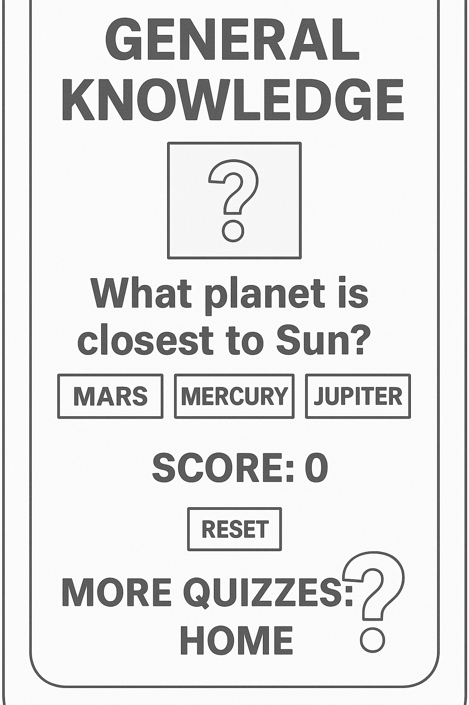
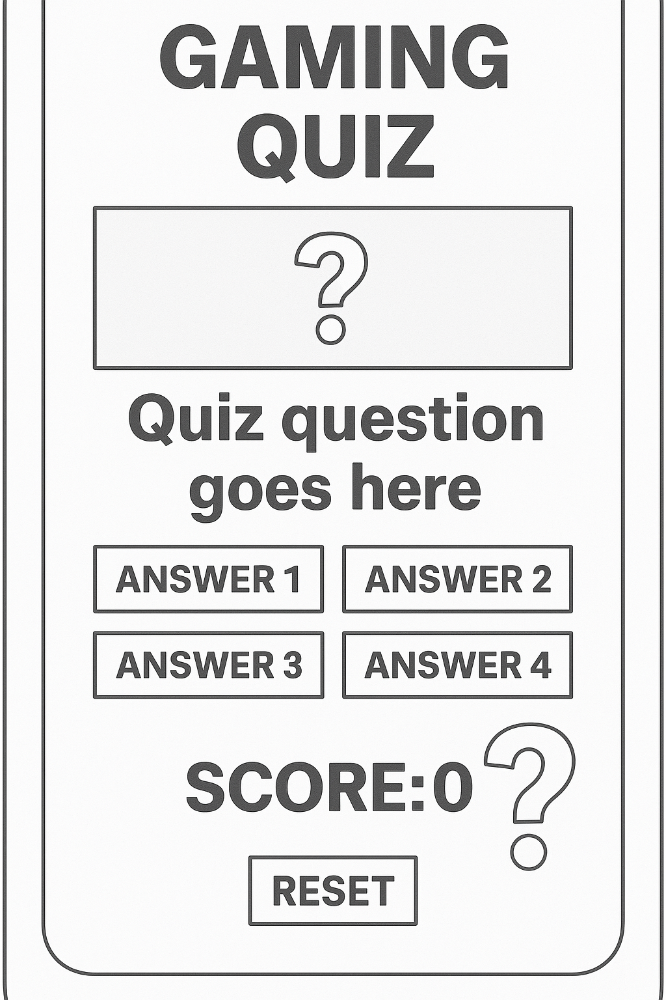
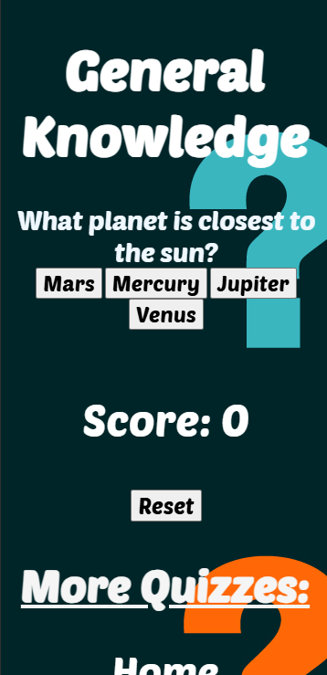
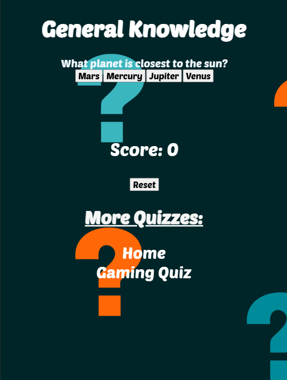
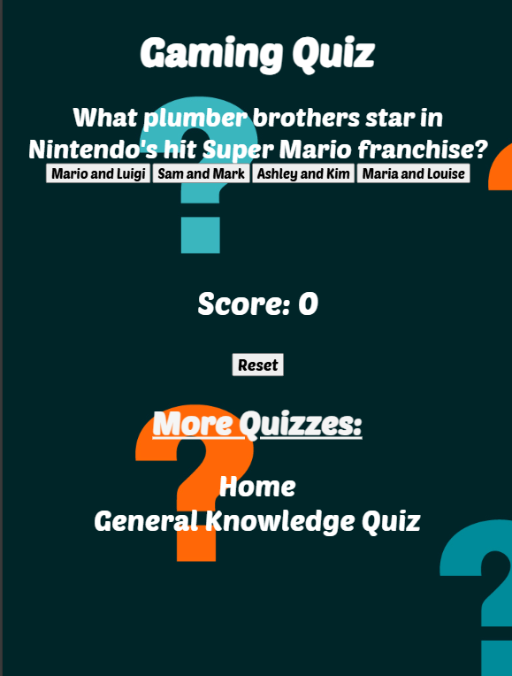
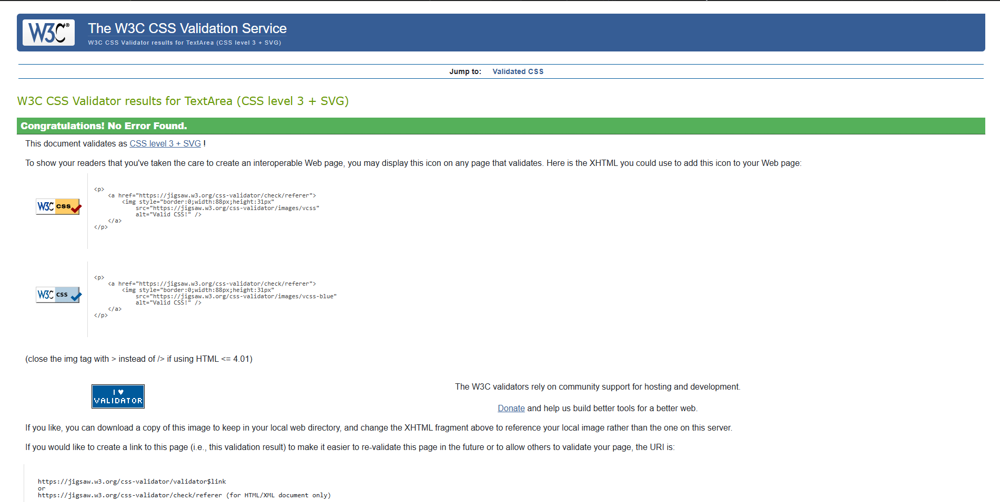
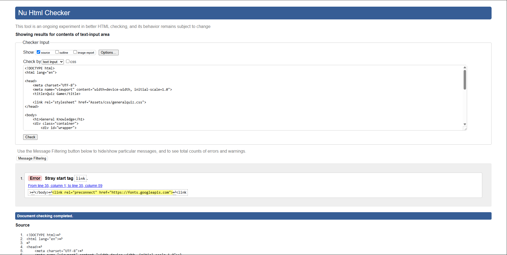
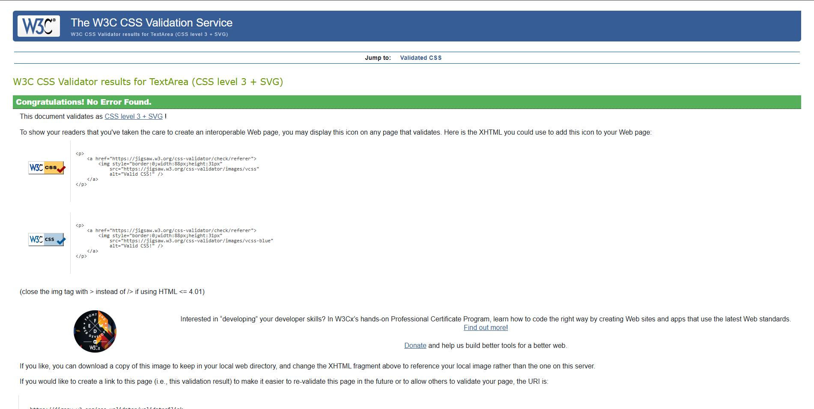

# Quiz World
## Milestone Project 2
### <u>About the Project</u>
This website's aim is to test people's knowledge on various topics so people can learn new things while also having fun in the process. 
It offers a wide range of topics from gaming to general knowledge and many more topics and questions to come.

### <u> About Quiz World </u>
Quiz World is a growing website with the plan of having the most quiz topics and questions than anywhere else on the internet. It is divided into various different pages with different quiz topic. Founded by a coding student who wanted to test their knowledge while also designing their class project.

### <u>Design </u>
The website is designed with various different pages, with the main page having a list of all quiz topics and pages. With easy to read font and text colour.

### <u>Wireframes </u>

### <u>Deployment </u>
I hosted my project using GitHub which was linked to my Visual Studio Code.
### <u>My Repository </u>
I created Quiz World Repository on GitHub. Then I created the HTML & CSS index pages and copied and pasted the following into the command line:  
`echo "# test" >> README.md`  
`git init`  
`git add README.md` 
`git commit -m "first commit"` 
`git branch -M main` 
`git remote add origin https://github.com/bryonybailey485/test.git` 
`git push -u origin main` 

This linked the GitHub Repository to the Visual Studio index pages. I could then easily make changes to my project.

I would use `git add .` to tell Git that I want to include updates to my repository file.   By using `git commit -m "Updates or changes made"` I would commit the updates and note down the updates or changes made within the quotation marks.  Then I would use `git push` to finalise and push the new updated code to my repository.

## <u> Hosting </u>
I went to Github, selected the Quiz World repository and went to the repository settings. Within the settings, I selected the following options:
- I selected the 'Deploy from branch' setting within the source settings.
- From the dropdown menu within the branch settings, I selected 'Main' and then 'Root' then saved the options.

This allowed me to host my website.

## <b><u>Mobile Version </b></u>
![Main Page] (assets/images/QuizWorld-Home.png)

## <b><u>Tablet Version </b></u>

## <b><u> Code Validation </u></b>
### General Quiz
#### CSS Validation

#### HTML Validation

### Gaming Quiz
#### CSS Validation

#### HTML Validation

| Browser    | Device | Apperance | Responsiveness |
|------------|--------|-----------|----------------|
| Chrome    |Macbook Pro / Ipad and Windows|All pages work correctly | Reponsive 
| Edge    |Macbook Pro / Ipad and Windows|All pages work correctly | Reponsive 
| Firefox    |Macbook Pro / Ipad and Windows|All pages work correctly | Reponsive 

## <b><u> Responsive Testing </u></b>
| Device | Small Width Devices (300px) | Medium Width Devices (500px) | Large Width Devices(800px) |
|--------|-----------------------------|------------------------------|----------------------------|
|<b>Galaxy Z Fold 5</b> | Everything working well and fits screen, | N/A | N/A|
|<b>Surface Pro</b> | N/A | Everything working and loading well, | N/A|
|<b>iPad Air</b>  | N/A | N/A | Works and Loads well, everything fits the screen perfectly.|
|

## Credits And References
Throughout the project I used code snippets from Code Insitute's Love Running Project, W3schools.com and Code Insitute Mentor.

